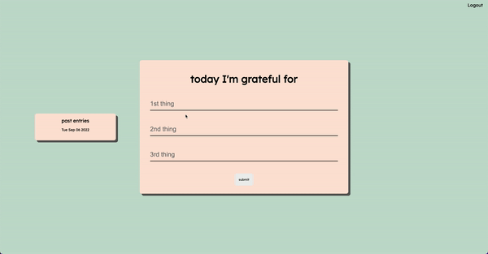
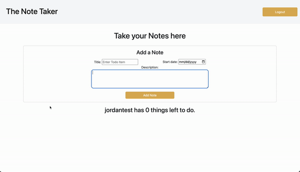
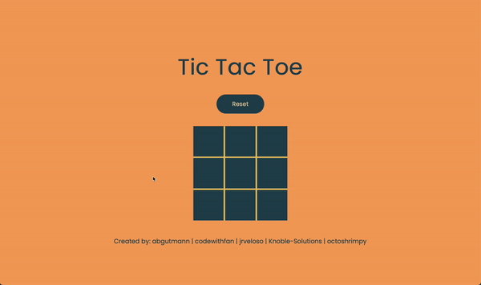

<h1 align="center">Hi there, I'm Jordan</h1>
<h3 align="left">I'm a fullstack software engineer from Chicago, IL</h3>

Continually inspired by the ways technology can improve our everyday lives and motivated to create positive changes with it.

Here's my [site](https://jordan-veloso.netlify.app/) for more info!

  <!---
  <a href="https://www.w3.org/html/" target="_blank" rel="noreferrer"> 
               
  
  
  
  
---->

<h3 align="left">Connect with me:</h3>

  
  

<!--Project Section -->

<h2 align="center">Projects </h2>

<table>
<tr>
  <td width="50%">
    <h3 align="center" color="white">Gratitude Journal</h2>
    
  
      
       
       
      

          
        
      

      
A CRUD app w/ auth for users to practice daily gratitude.

    

  </td>

<!------
<td width="50%">
  <h3 align="center" color="white">To Do List CRUD App w/ MVC & Auth</h2>
  
  
    
     
     
    

        
      
    

    
<strong>JavaScript, CSS3, Bootstrap, HTML5, Node, Express, Passport, Mongoose, MongoDB</strong> — Collaborated with other devs to build a responsive To Do List app w/ MVC structure and auth.

  

</td>
---->
<td width="50%">
  <h3 align="center" color="white">Sunnyside Creative Agency Landing Page</h2>
  
  
    
     
     
    

        
      
    

    
A responsive desktop and mobile friendly interface for customers of Sunnyside Creative Agency.

  

</td>
<tr>
  
 <td width="50%">
  <h3 align="center" color="white">Bar and Grill Restaurant Landing Page</h2>
  
  
    
     
     
    

        
      
    

    
A responsive desktop and mobile friendly interface for customers of Coco's Bar and Grill.

  

</td>

<td width="50%">
  <h3 align="center" color="white">Tic Tac Toe</h2>
  
  
    
     
     
    

        
      
    

    
2 player Tic Tac Toe

  

</td>
<tr>
<!---- coming
<td width="50%">
<h3 align="center" color="white">Coming Soon</h2>

  

 
 

  

<strong></strong> - 

---->
</table>
