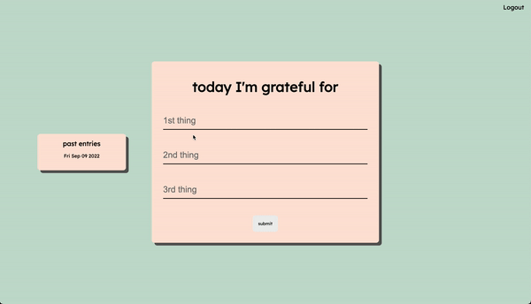

# Hi there, I'm Jordan! 
I am a software engineer, and former registered nurse. 

## I enjoy:

* Learning and building (more recently in public)
* Problem-solving creative solutions to improve user experience
* Creating beautiful websites and tinkering with code   

## 🌱 My skills:
* Building responsive full stack web applications using Javascript, React, Nodejs, MongoDB
* Building REST APIs using the MERN stack  
  

## 📬 How to reach me:
* [My personal portfolio site](https://jordan-veloso.netlify.app)
* [My blog site](https://jordandan.hashnode.dev)
* [LinkedIn](https://linkedin.com/in/jordan-veloso)
* [Twitter](https://twitter.com/JordanRVeloso)

## 🔭 I’m currently working on 

  - A habit tracking web app that encourages sustainable habit building   
    -  This site is being built with <b>Reactjs, Nodejs, Expressjs, and MongoDB</b>.
   

## ⚡ Fun fact:
One of the reasons I transitioned from nursing to technology is because I became interested in the significant impact that thoughtful software had on the workflow of healthcare professionals, which ultimately impacted the outcomes of our patients. I ended up falling in love with the problem-solving and refactoring aspects of programming, which felt similar to how I continually refined my workflow as a nurse so every patient received outstanding care.
  

<!--Project Section -->
<h2 align="center">Projects</h2>

<table>
  <tr>
    <td width="50%" valign="top">
      <h3 align="center" color="white">Playbook</h3>
       
      
       
      

          
        
      

      
A social CRUD app w/ auth for NBA fans to talk hoops and track stats. My NBA API trial expired, watch a demo <a target="_blank" href="https://www.youtube.com/watch?v=PHN5IcvfWA4">here!</a>

    </td>
    <td width="50%" valign="top">
      <h3 align="center" color="white">Gratitude Journal</h3>
       
      
       
      

          
        
      

      
A CRUD app w/ auth for users to practice daily gratitude.

    </td>
  <tr>
    <td width="50%" valign="top">
      <h3 align="center" color="white">KBLS Corp</h2>
       
      
       
      

          
        
      

      
A responsive and mobile friendly interface designed for clients of KBLS Corp to learn about and contact the company.

    </td>
    <td width="50%" valign="top">
      <h3 align="center" color="white">Sunnyside Creative Agency Landing Page</h3>
       
      
       
      

          
        
      

      
A responsive desktop and mobile friendly interface for customers of Sunnyside Creative Agency.

    </td>
<!---- coming
<td width="50%">
<h3 align="center" color="white">Coming Soon</h2>

  

 
 

  

<strong></strong> - 

---->
</table>
